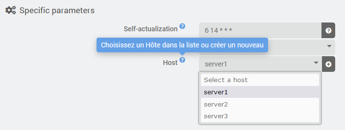

# SSH Manager

## User Documentation

Please check <https://titidom-rc.github.io/Documentation/fr_FR/SSHManager> for documentation on how to use this plugin on your Jeedom

## Developer documentation

This plugin can be easily use from your own plugin if you need to execute ssh commands to a remote host.

### Installation

Your plugin must depend on **SSH Manager** plugin. You have several possibilities to achieve this:

- Inform users that they should install **SSH Manager** before/together with your own plugin
- make sure to check for **SSH Manager** presence in your *dependancy_info()*
- or, if you use *packages.json* to install you dependencies by the core, make sure to have following lines in it:

```JSON
{
  "plugin": {
    "sshmanager" : {}
  }
}
```

### Configuration

First part is probably to let user of your plugin (we will call it the *client plugin*, client of **SSH Manager**) select a remote host, you will need it somewhere in your equipment or plugin configuration.

#### HTML

In your `desktop/php/myclientplugin.php` you need to foresee input fields that will allow user to select the remote host and even to add new one directly from your plugin if needed. Please find below a code snippet that you can reuse as is. You only need to adapt the `data-l2key="host_id"` if you whish.

```HTML
<div class="form-group">
    <label class="col-sm-4 control-label help" data-help="{{Choisissez un hôte dans la liste ou créez un nouveau}}">{{Hôte}}</label>
    <div class="col-sm-3">
        <div class="input-group">
            <select class="eqLogicAttr form-control roundedLeft sshmanagerHelper" data-helper="list" data-l1key="configuration" data-l2key="host_id">

            </select>
            <span class="input-group-btn">
                <a class="btn btn-default cursor roundedRight sshmanagerHelper" data-helper="add" title="{{Ajouter un nouvel hôte}}">
                    <i class="fas fa-plus-circle"></i>
                </a>
            </span>
        </div>
    </div>
</div>
```

The important part is to keep a select with `sshmanagerHelper` class and attribute `data-helper="list"`.

We recommande as well to keep a button (`a` tag) with `sshmanagerHelper` class and attribute `data-helper="add"`.

#### Include JS

In the same file, you need to include our helper js file. Do this at the same place than other js include:

```PHP
<?php include_file('desktop', 'sshmanager.helper', 'js', 'sshmanager'); // do not change anything on this line ?>
<?php include_file('desktop', 'myclientplugin', 'js', 'myclientplugin'); ?>
<?php include_file('core', 'plugin.template', 'js'); ?>
```

#### JS

In your `desktop\js\myclientplugin.js`, you need to call `buildSelectHost()` function. The argument is the current value so the function can select it correctly once the list is build.

```JS
function printEqLogic(_eqLogic) {
  buildSelectHost(_eqLogic.configuration.host_id);
}
```

#### Result

The dropdown list will be filled with available hosts create is **SSH Manager**



After clicking on the small "Add" button, a modal will open to let user create a new **SSH Manager** host without leaving your plugin configuration screen


After clicking *save*, the new host will be directly available in the dropdown list

### Usage

#### Execute SSH commands

Following function from *sshmanager* class is available. First argument is the host Id. It should match the one retrieve during configuration and second argument is an array of SSH commands. Each one will be executed one by one in the same session but different context, if you need to preserve the context, please provided severals commands in the same item separated by `;` (as you would do in a terminal)

```PHP
/**
  * execute ssh cmd on the remote host provided by hostId
  *
  * @param int $hostId
  * @param array $commands
  * @return array $results
  */
public static function executeCmds($hostId, array $commands) {}
```

`$commands` must be an array, if you have only one, provide an array with a single item.

Example:

```PHP
$commands = [
  'mv -f /tmp/config.yaml /opt/my_app/config.yaml',
  'cd /opt/my_app/; sudo make install'
]
$outputs = sshmanager::executeCmds($this->getConfiguration('host_id'), $commands);
```

return value, `$outputs` in the example, will be an array providing one item by commands, so:

- $outputs[0] is the result of $commands[0]
- $outputs[1] is the result of $commands[1]
- ...

Each output items are as well an array of lines because each commands can provide more than one line, so:

- $outputs[0][0] is first line of the output of the first command
- $outputs[0][1] is second line of the output of the first command
- $outputs[0][2] is third line of the output of the first command
- ...

#### retrieve remote file

tbd.

#### send file to remote

tbd.
